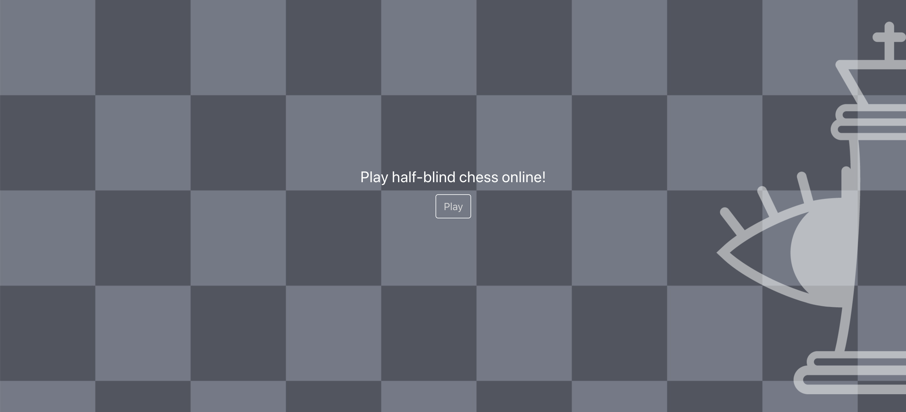

## Half-Blind Chess

Half-blind chess ([half-blind-chess.web.app](https://half-blind-chess.web.app)) is a free, adless and open-source chess project for the half-blind variant.

Released in early 2020, the project is still in its early stages. If you notice any bugs, imagine any improvements, or want to contribute in any way, feel free to comment, raise an issue or submit a pull request.

### Dependencies

Half-blind chess is a MERN project ([MySQL](https://www.mysql.com/) + [Express](https://expressjs.com/) + [React](https://reactjs.org/) + [Node.js](https://nodejs.org/en/)). The game engine is powered by [chess.js](https://github.com/jhlywa/chess.js/blob/master/README.md), and styling is aided by Bootstrap (specifically [React Bootstrap](https://react-bootstrap.github.io/)).
